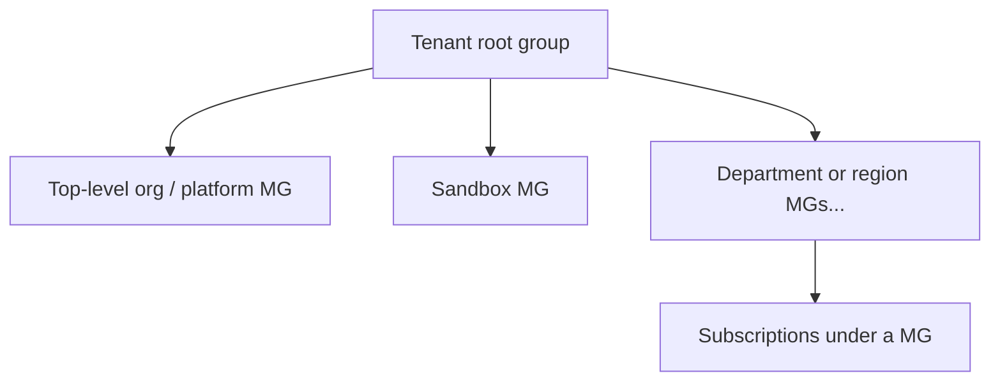

# Module: Design for governance

**Module on Learn:** [Design for governance](https://learn.microsoft.com/en-us/training/modules/design-governance/)

**Scenario (from Learn):** Tailwind Traders — a fictional retailer; you think like the CTO who needs **governance** so Azure stays manageable, compliant, and cost-visible.

---

## 1. Introduction

**Unit:** [Introduction](https://learn.microsoft.com/en-us/training/modules/design-governance/1-introduction)

### In plain terms

- **Governance** = defining **rules and policies**, then making sure they are **actually enforced** (not just documented).
- **Why it matters in Azure:** Without it, many teams and subscriptions can produce sprawl, inconsistent security, and unclear spend.

### When governance matters most

- Several engineering teams on Azure
- Many **subscriptions** to coordinate
- **Regulatory** or legal requirements
- Organization-wide **standards** (for example encryption, naming, regions)

### Learning objectives (this module)

You learn how to design for:

- Governance (overall)
- **Management groups**
- **Subscriptions**
- **Resource groups**
- **Azure Policy**
- **Resource tags**
- **Azure landing zones**

### Your notes (fill as you go)

- **What “governance” means to me in one sentence:**
- **My org’s top risk if we skipped governance:**

---

## 2. Design for governance

**Unit:** [Design for governance](https://learn.microsoft.com/en-us/training/modules/design-governance/2-design-for-governance)

### In plain terms

Per [Microsoft Learn — Design for governance](https://learn.microsoft.com/en-us/training/modules/design-governance/2-design-for-governance), **governance** is the set of **mechanisms and processes** that keep **control** over applications and resources in Azure. It is not only documentation: it includes **figuring out requirements**, **planning initiatives**, and **setting priorities** so the environment matches what the business and compliance need.

You apply governance **through a hierarchy**: structure the org’s Azure estate so you can attach rules (and visibility) **at the right scope**. This module’s concrete **governance tools** are **Azure Policy** and **resource tags** (covered in later units).

### The Azure hierarchy (four levels)

Learn presents a typical structure (often shown top-down):

| Level | Role in one line |
|--------|------------------|
| **Management groups** | Group subscriptions so you can manage **access**, **policy**, and **compliance** across many subscriptions at once. |
| **Subscriptions** | **Logical containers** for workloads: unit of **management and scale**, and a **billing boundary**. |
| **Resource groups** | **Logical containers** where resources are **deployed** and **managed** together (lifecycle and organization). |
| **Resources** | **Instances** of Azure services (for example VMs, storage accounts, SQL databases). |

### Tenant root group (easy to overlook)

- The **tenant root group** sits at the top and **contains** all management groups and subscriptions.
- Use it when you need **directory-wide** (tenant-level) effect: **Azure Policy** and **Azure role assignments** applied at the broadest scope.

### Design angle (why the hierarchy matters)

- **Without** a clear hierarchy, you either **over-restrict** (one-size-fits-all) or **under-govern** (exceptions everywhere).
- **With** levels, you can push **broad rules** high (for example compliance baselines) and **narrower rules** lower (for example team-specific tags or policies).

### Your notes (optional)

- **Where our org would attach “must apply everywhere” vs “team-specific” rules:**

### Remember for the exam

- Governance = **control** via **process + mechanisms**; needs **requirements**, **planning**, **priorities**.
- Know the **four hierarchy levels** and what each is **for** (especially: subscriptions = **billing** + scale/management; resource groups = **deployment/management** grouping).
- **Tenant root group** = top container; supports **global** **Policy** and **RBAC** at directory scope.
- This module’s called-out **governance strategies**: **Azure Policy** and **resource tags**.

---

## 3. Design for management groups

**Unit:** [Design for management groups](https://learn.microsoft.com/en-us/training/modules/design-governance/3-design-for-management-groups)

Official reference: [Management groups in Azure](https://learn.microsoft.com/en-us/azure/governance/management-groups/overview).

### In plain terms

**Management groups** are **containers** that let you govern **access**, **Azure Policy**, and **compliance** across **multiple subscriptions** at once—without repeating the same assignments on every subscription.

Typical reasons to use them (from the unit):

- **Policy at scale:** For example, **restrict which regions** VMs can be created in, **across** subscriptions.
- **Access at scale:** **One role assignment** at a management group can **inherit** down so users reach **multiple** subscriptions (where inheritance applies).
- **Visibility:** **Monitor and audit** **role** and **policy** assignments **across** subscriptions.

### Things to know (characteristics)

| Topic | Detail |
|--------|--------|
| **Policy** | Management groups **aggregate** **policy** and **initiative** assignments (via **Azure Policy**). |
| **Depth limit** | A management group tree supports up to **six levels of depth**. That **does not** count the **tenant root** level or the **subscription** level. |
| **RBAC on management groups** | **Azure RBAC** for management group **operations** is **not enabled by default** (you can turn it on where needed). |
| **New subscriptions** | **By default**, new subscriptions are placed under the **root management group**. |

### Things to consider (design patterns)

The unit uses **Tailwind Traders** (Sales with **West** / **East**, **Corporate** with HR/Legal, **IT** with R&D and production, etc.) to illustrate **how** you might shape the tree—not a single “correct” answer, but **design dimensions**:

- **Governance-first:** Put **Azure Policy** at the **management group** level for workloads that need the **same** security, compliance, connectivity, and feature posture.
- **Depth:** Keep the tree **reasonably flat**. The module suggests planning for **about three or four** management group levels for Tailwind. **Too flat** → less flexibility for large orgs; **too deep** → harder to operate and reason about.
- **Top-level management group:** Often useful for **organization-wide** “**platform**” **policies** and **Azure role** assignments that should apply **everywhere** (under the tenant root).
- **By org / department:** Align groups to **business structure** (for example **Sales**, **Corporate**, **IT**).
- **By geography:** Separate groups when **regional compliance** or rules differ (for example **West** vs **East** sales regions).
- **Production:** A **production** management group can carry **product-wide** or **corporate product** policies.
- **Sandbox:** A **sandbox** group lets people **experiment**, **isolated** from dev / test / production and from rules that apply to “official” workloads.
- **Sensitive workloads:** **Isolate** high-sensitivity data (for example **Corporate** / HR / Legal) in a **separate** management group with **standard plus enhanced** compliance policies.

### Hierarchy sketch (conceptual)

Child management groups and subscriptions hang under parents; **policy and RBAC** can flow down the tree (subject to how you assign scopes—exam questions often test **scope** and **inheritance**).

### Your notes (optional)

- **Our org:** would we align MGs by **business unit**, **environment**, **region**, or a **mix**—and why?

### Remember for the exam

- Management groups = **multi-subscription** governance for **Policy**, **compliance**, and **access** (inherited role assignments where applicable).
- **Six** depth levels max in the MG tree (**excluding** tenant root and subscription).
- **RBAC** on management group **operations**: **off by default**.
- **New subscriptions** → **root management group** by default.
- Design trade-off: **flat vs deep** hierarchy; use cases for **platform** MG, **sandbox**, **geo**, **sensitive** isolation.

---

## 4. Design for subscriptions

**Unit:** [Design for subscriptions](https://learn.microsoft.com/en-us/training/modules/design-governance/4-design-for-subscriptions)

Related docs: [Azure subscription and service limits](https://learn.microsoft.com/en-us/azure/azure-resource-manager/management/azure-subscription-service-limits), [subscription offer types](https://azure.microsoft.com/support/legal/offer-details/).

### In plain terms

An Azure **subscription** is a **logical container**: it is a **unit of management and scale**, a **billing boundary**, and where **limits and quotas** apply. You need at least one subscription to create and pay for Azure services.

Organizations use subscriptions to **group cost and resources** (for example by team, environment, or workload) and to **apply governance** at a scope below the tenant but above resource groups.

### Things to know (characteristics)

| Topic | Detail |
|--------|--------|
| **Billing** | Subscriptions can separate **billing environments** (for example **development**, **test**, **production**). |
| **Compliance** | **Policies** scoped to a subscription can target **different compliance** needs than other subscriptions. |
| **Scale** | You can place **specialized workloads** in their **own** subscription to grow past **limits** of an existing subscription. |
| **Cost visibility** | Subscriptions help **manage and track** spend in line with **organizational** structure. |
| **Offer types** | There are **several subscription types** (for example Enterprise Agreement, Pay-As-You-Go)—see [offer details](https://azure.microsoft.com/support/legal/offer-details/). |

### Things to consider (design decisions)

- **Subscriptions as a “democratized” management unit:** Shape them around **business needs and priorities**, not a single template.
- **Under management groups:** Put subscriptions that need the **same** **policies** and **Azure role assignments** under the **same** management group so they **inherit** those settings (example from the module: **West** and **East** sales subscriptions inheriting from the **Sales** management group).
- **Shared services subscription:** Often use a **dedicated** subscription for **shared network** platforms so spend is **grouped** and workloads stay **isolated** from app teams—examples called out: **ExpressRoute**, **Virtual WAN**.
- **Scale limits:** Treat a subscription as a **scale unit**. Large or specialized footprints (**HPC**, **IoT**, **SAP**) often deserve **separate** subscriptions so you do not hit **service limits** (the module cites an example such as a limit of **50 Azure Data Factory integrations**—confirm current numbers in [subscription limits](https://learn.microsoft.com/en-us/azure/azure-resource-manager/management/azure-subscription-service-limits)).
- **Administration:** Subscriptions are a **management boundary** and **separation of duties**—decide if each subscription needs **distinct** administrators (example: **Corporate** might use **one** subscription for both **HR** and **Legal**).
- **Where to assign Azure Policy:** Both **management groups** and **subscriptions** are valid **assignment scopes**. For strict isolation (example: **PCI** workloads), a **subscription** alone can provide the boundary instead of creating **extra** management groups with only **one or two** subscriptions—keeps the **MG** structure from sprawl.
- **Networking:** A **virtual network** does **not** span subscriptions. Cross-subscription connectivity uses patterns such as **virtual network peering** or **VPNs**—when designing subscriptions, consider **which workloads must talk to which** other workloads.
- **Ownership:** Make **subscription owners** clear on **roles and responsibilities**; the unit suggests **access reviews** (for example **quarterly** or **biannual**) using **Microsoft Entra Privileged Identity Management** so privilege does not grow unchecked.

### Subscription vs management group (quick contrast)

| Question | Lean toward |
|----------|-------------|
| Same policies/RBAC for many subs | **Management group** inheritance |
| Hard isolation, billing, or quota (PCI, huge workload) | Often a **dedicated subscription** |
| Too many tiny MGs each with 1–2 subs | Rebalance: use **subscriptions** for some isolation instead |

### Your notes (optional)

- **Environments we’d put in separate subscriptions vs one subscription + tags/RGs:**

### Remember for the exam

- Subscription = **management + scale** + **billing**; **quotas/limits** apply at subscription scope.
- **VNets are per subscription** (not shared across subscriptions); link with **peering** / **VPN** as needed.
- **Shared services** subscription for common networking (**ExpressRoute**, **Virtual WAN**) and consolidated billing.
- **Policy** can be assigned at **MG** or **subscription**; **PCI-style** isolation can be **subscription**-scoped to avoid **management group** sprawl.
- **Governance hygiene:** subscription **owners** + **PIM** **access reviews**.

The module closes with: **one size does not fit all**—what works for one business unit may not suit another ([Design for subscriptions](https://learn.microsoft.com/en-us/training/modules/design-governance/4-design-for-subscriptions)).

---

## 5. Design for resource groups

**Unit:** [Design for resource groups](https://learn.microsoft.com/en-us/training/modules/design-governance/5-design-for-resource-groups)

Background: [Azure Resource Manager and resource groups](https://learn.microsoft.com/en-us/azure/azure-resource-manager/management/overview).

### In plain terms

A **resource group** is a **logical container** for Azure resources you deploy and manage together (web apps, databases, storage, and so on). It is a **management and governance** boundary **below** the subscription—not a second network or billing boundary by itself.

You use resource groups to:

- Group resources by **similar usage, type, or location**
- Align resources that share a **life cycle** (create, update, or **delete** as a unit)
- Apply **RBAC** (who administers a **set** of resources)
- Use **resource locks** to block accidental delete or change

### Things to know (characteristics)

| Topic | Detail |
|--------|--------|
| **Resource group “location”** | Each resource group has a **region**; that region stores **metadata** for the resource group. |
| **Metadata outage** | If that region is **temporarily unavailable**, you **cannot update** resources **in** that resource group (metadata unavailable). Resources running in **other** regions may **keep working**, but **management** updates can be blocked. |
| **Resource regions** | Resources **inside** a resource group **can** live in **different** regions than each other and than the RG’s metadata region. |
| **Cross–resource group** | A resource can **depend on or connect to** resources in **another** resource group (example from the module: web app in one RG, database in another). |
| **Move** | Resources can be **moved** between resource groups (and subscriptions) with [documented exceptions](https://learn.microsoft.com/en-us/azure/azure-resource-manager/management/move-resource-group-and-subscription). |
| **Membership** | You can **add** or **remove** a resource from a resource group **at any time** (subject to support for the move). |
| **Nesting** | Resource groups **cannot** be nested. |
| **Cardinality** | Each resource belongs to **exactly one** resource group. |
| **Rename** | Resource groups **cannot** be **renamed** (plan the name up front). |

### Things to consider (design patterns)

The module uses **Tailwind Traders** with **App1** and **App2** (each with web tier, SQL, VMs, storage) to illustrate choices—not one mandatory layout:

- **By resource type:** Useful for **shared** or **on-demand** services **not** tied to a single app (example pattern: **SQL-RG** for databases, **WEB-RG** for web workloads).
- **By application:** When everything shares the **same policies** and **life cycle**, put **one app** in its **own** resource group (App1 RG vs App2 RG); also common for **test** or **prototype** environments.
- **Other axes:** **Department**, **region**, **billing / cost center**—less universal but valid when the business needs it.
- **Combination:** Often **mix** strategies (for example app-based groups plus a shared type-based group).
- **Life cycle:** If you must **deploy, update, or tear down** components **together**, favor putting them in the **same** resource group.
- **Administration overhead:** More resource groups = more to operate; match **centralized** vs **decentralized** admin models.
- **Access control:** At the resource group scope you can assign **Azure Policy**, **Azure RBAC**, and **[resource locks](https://learn.microsoft.com/en-us/azure/azure-resource-manager/management/lock-resources)** for critical workloads.
- **Compliance:** Ask whether **resource group metadata** must live in a **specific region** for data-residency or policy reasons.

### Your notes (optional)

- **Our default:** group by **app**, by **environment**, or by **shared platform**—and why:

### Remember for the exam

- Resource group = **logical** grouping for **management**; **not** “everything must be in one region.”
- RG **region** = **metadata** storage; outage there can **block updates** to resources in that RG even if workloads run elsewhere.
- **Cannot nest** RGs; **cannot rename**; each resource **exactly one** RG.
- Design patterns: **type** vs **app** vs **hybrid**; align RG boundaries to **life cycle** and **RBAC/Policy/locks**.

---

## 6. Design for resource tags

**Unit:** [Design for resource tags](https://learn.microsoft.com/en-us/training/modules/design-governance/6-design-for-resource-tags)

Background: [Tag resources](https://learn.microsoft.com/en-us/azure/azure-resource-manager/management/tag-resources).

### In plain terms

**Resource tags** are **name–value** metadata on Azure resources. They help you **organize**, **search**, **report cost**, and **drive automation**—but only if you use them **consistently**.

**Before a tagging project:** Decide **goals** (better search? cost chargeback? automation inputs?) so tags stay purposeful, not random.

### Things to know (characteristics)

| Topic | Detail |
|--------|--------|
| **Shape** | A tag is a **name = value** pair (for example `env = production`). Values can hold multiple concepts in text if your standard allows (example from the module: `env = dev, test`). |
| **Where tags attach** | Tags can be set on **individual resources**, **resource groups**, and **subscriptions**. |
| **Management** | Tags can be **added, changed, or removed** via **portal**, **PowerShell**, **Azure CLI**, **ARM templates**, **Bicep**, **REST**, etc. |
| **Inheritance (critical)** | Tags on a **resource group** are **not** automatically **inherited** by resources inside that RG. Each resource has its **own** tags unless you copy or enforce via **policy** / automation. |

### Things to consider (design)

- **Taxonomy:** Align names and values with **department language**, **compliance** terms, **cost** reporting, **locations**, **confidentiality**—whatever your org already uses.
- **IT-aligned vs business-aligned** (often **both**):

| Alignment | Focus | Example angle (from module) |
|-----------|--------|------------------------------|
| **IT-aligned** | Workload, app, function, **environment**—easier **operations** and monitoring. | Capacity/usage patterns (e.g. printers busy 80% of time → capacity decisions). |
| **Business-aligned** | **Ownership**, **cost responsibility**, **business criticality**, **value** of IT to the business. | Tie spend to outcomes (e.g. marketing print drove revenue → investment story). |

Many orgs move **toward business-aligned** tagging over time.

- **Five tag “types”** (categories to plan for—not exclusive buckets):

| Type | Role | Example pairs (from module) |
|------|------|------------------------------|
| **Functional** | Purpose inside a workload—**app**, **tier**, **env**, stack. | `app`, `tier`, `webserver`, `env` (prod/dev/staging). |
| **Classification** | **Usage** / policy hooks—confidentiality, SLA. | `confidentiality`, `SLA`. |
| **Accounting** | **Billing** / allocation—department, program, region. | `department`, `program`, `region`. |
| **Partnership** | **People** beyond IT—owners, contacts, stakeholders. | `owner`, `contactalias`, `stakeholders`. |
| **Purpose** | **Business** process, impact, investment decisions. | `businessprocess`, `businessimpact`, `revenueimpact`. |

- **Start small:** Pilot **a few** critical tags; prove value before expanding the taxonomy.
- **Enforce with Azure Policy:** Tagging fails without **consistency**—use Policy to **require** tags on create, **inherit** tags from RG where policies support it (for example “inherit tag from resource group”), or **remediate** drift.
- **Not everything needs every tag:** Example from the module: only **mission-critical** resources might need an `Impact` tag; **untagged** resources are then implicitly **non–mission-critical** by policy.

**Stakeholders:** Good tagging needs input from **finance**, **apps**, **security**, not only central IT.

### Your notes (optional)

- **Our first three tags** (name + who owns the value):

### Remember for the exam

- Tags = **metadata** (**name/value**); **RG tags do not inherit** to child resources.
- Design dimensions: **taxonomy**, **IT vs business** alignment, **five** tag categories, **Policy** for **enforcement** and **consistency**.
- **Start minimal**, **scale** the tag model; not every resource needs **every** tag.

---

## 7. Design for Azure Policy

**Unit:** [Design for Azure Policy](https://learn.microsoft.com/en-us/training/modules/design-governance/7-design-for-azure-policy)

Background: [Azure Policy overview](https://learn.microsoft.com/en-us/azure/governance/policy/overview), [built-in policies](https://learn.microsoft.com/en-us/azure/governance/policy/samples/built-in-policies), [built-in initiatives](https://learn.microsoft.com/en-us/azure/governance/policy/samples/built-in-initiatives).

### In plain terms

**Azure Policy** helps you **define**, **assign**, and **manage** rules so **resource configurations** match **organizational standards**—by **blocking** bad changes, **auditing**, **remediating**, or **deploying** related fixes.

### Things to know (characteristics)

| Topic | Detail |
|--------|--------|
| **Definitions** | A **policy** is one rule; an **initiative** bundles **multiple** related policies (easier to assign a standard at once). Many **built-in** definitions exist. |
| **Inheritance** | Policy assignments **flow down** the hierarchy (management group → subscription → resource group → resource), consistent with earlier units. |
| **Scope** | Assign at **management group**, **subscription**, **resource group**, or **resource** (as supported). |
| **What is evaluated** | Resources in Azure and **Azure Arc–enabled** resources (supported **resource types** hosted outside Azure). |
| **Visibility** | Non-compliant resources surface in **compliance** views. |
| **Enforcement** | Can **prevent** non-compliant **creates/updates**, and support **automatic remediation** (for example tag fixes, **DeployIfNotExists** patterns). |
| **DevOps** | Integrates with **Azure Pipelines** for **pre-** and **post-deployment** policy checks. |

### Things to consider (design and operations)

- **Compliance dashboard:** Use it for an **aggregated** view, **drill-down** per resource/level, **bulk remediation** for existing resources, and paths toward fixing drift **faster** (module context: Tailwind Traders).
- **When evaluation runs** (not always instant—plan for **delay**):

  - Resource **created**, **deleted**, or **updated** in a scope that has assignments
  - Policy or initiative **newly assigned** to a scope
  - An assignment is **updated**
  - **Scheduled** compliance scan (**about every 24 hours**)

- **Responses to non-compliance** (depends on **effect** and design): **Deny** the change; **Audit** / log; **Modify** / **Append** behavior; **DeployIfNotExists** or related patterns to bring in compliant pieces.

- **Remediation:** Especially useful for **tags**—Policy can **apply** or **reapply** tags when someone removes them (example: enforce a `Location`-style tag on resources in a resource group).

- **Policy vs RBAC (module wording—use together):**

| | **Azure Policy** | **Azure RBAC** |
|---|------------------|----------------|
| **Question it answers** | Is the **resource configuration** allowed (state **compliance**)? | **Who** may **invoke** Azure control-plane actions? |
| **Depends on user?** | Evaluates **outcome**—**who** changed it is secondary to whether the **result** matches the rule. | Controls **identity** access and **actions** at a scope. |
| **Together** | Even if RBAC **allows** an action, Policy can **deny** the **result** (non-compliant create/update). |

### “Control resource access” (identity lifecycle—module closing)

After identity basics, think through **what** identities may reach, **how** access is enforced (**RBAC**, **Conditional Access**), **monitoring** (**Entra ID Protection**), and **reviews** (**access reviews**). Policy complements this by governing **resource state**, not replacing **who** is authenticated.

### Your notes (optional)

- **Policies we’d assign at Production MG vs at app RG:**

### Remember for the exam

- **Initiative** = **group** of policies; **built-ins** are a starting point.
- **Evaluation triggers** include CRUD in scope, assignment changes, and **~24h** cycle.
- **Policy** = **compliance / resource state**; **RBAC** = **who can act**; both layers used together.
- **Remediation** + **tagging** are a classic exam pairing.

---

## 8. Design for role-based access control (RBAC)

**Unit:** [Design for role-based access control (RBAC)](https://learn.microsoft.com/en-us/training/modules/design-governance/8-design-for-role-based-access-control)

Background: [Azure RBAC overview](https://learn.microsoft.com/en-us/azure/role-based-access-control/overview), [Custom roles](https://learn.microsoft.com/en-us/azure/role-based-access-control/custom-roles).

### In plain terms

**Azure RBAC** decides whether an identity **may invoke** Azure **control-plane** actions on resources. Each request is evaluated: **denied** (no permission), or **allowed** per **role assignments**.

The module stresses an **allow model**: a **role** lists **allowed** actions; the identity gets **only** what those roles grant (for example **read** without an explicit **write** permission does not grant write).

### Example scenarios (Tailwind-style)

- One user manages **VMs** in a subscription; another manages **virtual networks**.
- A **database administrator** **group** manages **SQL** resources.
- A user manages **all** resources in **one** **resource group** (VMs, web apps, subnets, etc.).
- An **application** (service principal / managed identity) accesses resources in **one** resource group.

### Things to consider (design)

- **Scope at the broadest level that still matches the need:** Define **roles** (built-in or custom), assign to **users, groups, or service principals**, and attach at **management group**, **subscription**, **resource group**, or **resource**. The module recommends assigning at the **highest scope that satisfies the requirement** so you avoid unnecessary fragmentation (pair with **least privilege** on the **role** itself).

- **Least privilege per person:** Grant the **minimum** role + **narrowest** scope needed—reduces blast radius if an identity is compromised; clarifies ownership.

- **Prefer roles on groups:** Assign to **Entra ID groups** instead of many **individual** user assignments when possible—fewer assignments to manage.

- **Policy + RBAC:** Use **both**—Policy for **resource properties** / compliance; RBAC for **who** may **act**. See comparison below.

| | **Azure Policy** | **Azure RBAC** |
|---|------------------|----------------|
| **Description** | Rules so resources stay **compliant** with standards. | **Authorization** for **who** can do **what** on which **scope**. |
| **Main focus** | **Properties** / configuration of resources. | **Access** to resources and actions. |
| **Implementation** | Assign **policies** / **initiatives**. | Assign **roles** at scopes. |
| **Default access** | By default, policy rules are set to **allow** (per module wording—contrast with **Deny** / audit **effects** on specific assignments). | By default, all access for all users is **denied** until **RBAC** grants it. |

- **Custom roles** when **built-in** roles are too broad or too narrow—[custom roles](https://learn.microsoft.com/en-us/azure/role-based-access-control/custom-roles) can be reused across **subscriptions** in the **same** Microsoft Entra tenant.

- **Overlapping assignments:** RBAC is **additive** for **allows**—effective permissions ≈ **union** of all applicable role assignments. Example from the module: **Contributor** at **subscription** + **Reader** on a **resource group** in that subscription → **Contributor** already includes **read**; the extra **Reader** on the RG **does not change** the effective access in that case.

### Your notes (optional)

- **Roles we’d use** for platform team vs app team vs read-only auditor:

### Remember for the exam

- RBAC = **allow** model for **roles**; **no** permission without an assignment (for allows).
- Assign at **appropriate scope**; **groups** over one-off user assignments; **least privilege**.
- **Policy** = **what** resources look like; **RBAC** = **who** can change them—**combine** both.
- **Overlapping** roles: **additive**; redundant **Reader** under **Contributor** adds nothing new.

---

## 9. Design for Azure landing zones

**Unit:** [Design for Azure landing zones](https://learn.microsoft.com/en-us/training/modules/design-governance/9-design-for-landing-zones)

Background: [Azure landing zones (Cloud Adoption Framework)](https://learn.microsoft.com/en-us/azure/cloud-adoption-framework/ready/landing-zone/), [implementation options / accelerator](https://learn.microsoft.com/en-us/azure/cloud-adoption-framework/ready/landing-zone/implementation-options), [transition existing to landing zones](https://learn.microsoft.com/en-us/azure/cloud-adoption-framework/ready/enterprise-scale/transition).

### In plain terms

An **Azure landing zone** is a **ready** **foundation** for running workloads in Azure—**identity**, **network/connectivity**, **governance (Policy)**, **management/monitoring**, and **subscription/MG structure** are in place **before** (or as part of) moving or building apps. The module uses a **utilities before houses** analogy: like water/power to a lot before construction, **platform services** should be available so migrations and new apps are **consistent** and **compliant**.

### Things to know (characteristics)

| Topic | Detail |
|--------|--------|
| **Shape** | Implemented via **management groups** and **subscriptions** sized to **business** needs and **priorities** (example pattern in Learn: SAP / Corporate / Online style zones). |
| **Platform vs application** | **Platform landing zone** — **shared** services (**identity**, **connectivity**, **management** subscriptions), often run by a **central** team. **Application landing zone(s)** — **workloads** / apps, commonly across **dev / test / production**. |
| **Policy** | **Azure Policy** ties to landing zones to keep the **platform** (and apps on it) **compliant** over time. |
| **Automation** | Landing zones are **provisioned with code** (repeatable, versionable). |
| **Scale** | Can span **migrations** and **new** development across the **portfolio**, not only one project. |
| **Accelerator** | Microsoft recommends the **Azure landing zone IaC** path (**Bicep** or **Terraform** via **Azure Verified Modules**); a **portal-based** accelerator exists for orgs with less IaC depth. |

### Things to consider (design)

- **Bake landing zones into overall design** — align **subscriptions** with business **scale** and **priorities**; use **Policy** as **guardrails** for platform **and** workloads.
- **Implement as code** — expect **refactoring** as requirements change; **iterate**; central review of short- vs long-term scenarios reduces rework.
- **Use the [landing zone accelerator](https://learn.microsoft.com/en-us/azure/cloud-adoption-framework/ready/landing-zone/implementation-options)** for an opinionated, full **conceptual** implementation (management groups, policies, key components).
- **Application-centric** — favor thinking in **applications** and **platform alignment**, not only **VM lift-and-shift**.
- **Azure-native** — prefer **platform services** where they fit; stay aligned with the **Azure roadmap**.
- **Migrations and greenfield** — scope so both **move** and **new build** can scale across **IT** broadly.
- **Existing Azure estates** — you can **transition** toward landing zones; one pattern is deploying the accelerator **in parallel** in the **same** Microsoft Entra **tenant** with a **new** management group tree that **does not** disturb the current environment initially ([transition guidance](https://learn.microsoft.com/en-us/azure/cloud-adoption-framework/ready/enterprise-scale/transition)).

**Optional assessment:** Microsoft points to an [Azure landing zone review](https://learn.microsoft.com/en-us/assessments/?mode=pre-assessment&id=21765fea-dfe6-4bc4-8bb7-db9df5a6f6c0) for organizations planning cloud build/migrate (module note: oriented toward more experienced customers; useful to spot investment areas if newer).

### Your notes (optional)

- **Platform vs app** subscriptions we’d want in our org:

### Remember for the exam

- Landing zone = **foundational** **environment** (MG/sub design + shared **platform** + **app** zones).
- **Platform** LZ (shared identity, connectivity, management) vs **application** LZ (workloads, envs).
- **Policy** + **code-first** deployment; **accelerator** (IaC / portal) as the supported implementation path.
- **Parallel** deploy + **transition** for brownfield Azure.

---

## 10. Module assessment

**Unit:** [Knowledge check](https://learn.microsoft.com/en-us/training/modules/design-governance/10-knowledge-check)

- **Questions I missed / why:**

---

## 11. Summary and resources

**Unit:** [Summary and resources](https://learn.microsoft.com/en-us/training/modules/design-governance/11-summary-resources)

- **Links or docs I want to revisit:**
